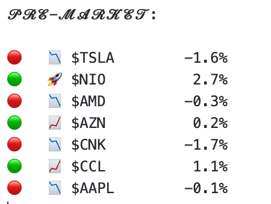
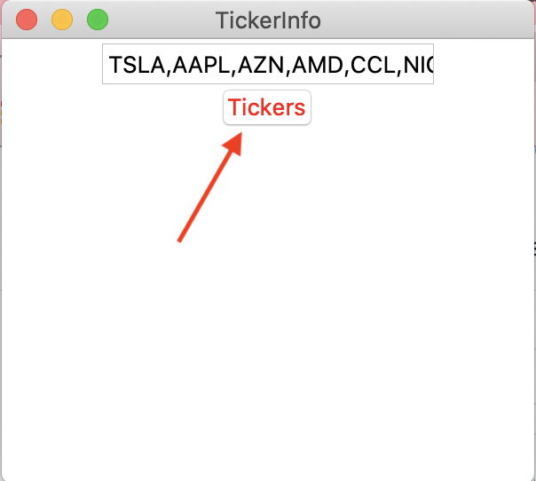
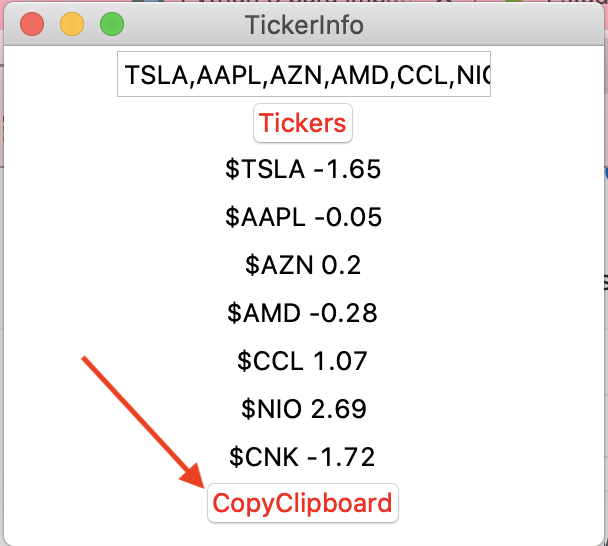

# TickersYahoo
python app to obtain yahoo finance price

This code is made with ktinker and Python to facilitate the creation of preformated text like this one:

First you have to write what tickers you want to use, the default are TSLA,AAPL,AZN,AMD,CCL,NIO,CNK. when ready just press the tickers button:

Once is all loaded, press CopyClipboard and you are ready:

